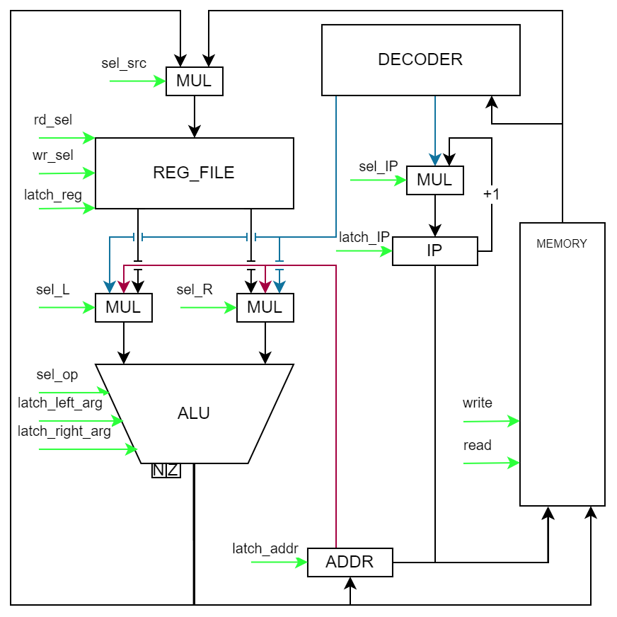

# ASM lang. Транслятор и модель

- Работу выполнил: Закиров Тимур Альбертович
- Учебная группа: P33092
- Номер ису: 305246
- Преподаватель: Пенской Александр Владимирович

```
asm | risc | neum | hw | instr | struct | stream | mem | cstr | prob2
```
Упрощённый вариант.

| Особенности             |                                                                     |
|-------------------------|---------------------------------------------------------------------|
| ЯП. Синтаксис           | Синтаксис ассемблера. Поддержка меток (labels).                     |
| Архитектура             | Система команд должна быть упрощенной, в духе RISC архитектур.      |
| Организация памяти      | Архитектура фон Неймана.                                            |
| Control Unit            | hardwired. Реализуется как часть модели.                            |
| Точность модели         | Процессор необходимо моделировать с точностью до каждой инструкции. |
| Представление маш. кода | Представление в виде высокоуровневой структуры.                     |
| Ввод-вывод              | Ввод-вывод осуществляется как поток токенов.                        |
| Ввод-вывод ISA          | Memory-mapped. Доступ к устройствам IO через память.                |
| Тип строк               | C - строки с нуль терминатором на конце.                            |
| Алгоритм                | Сумма всех чисел кратных 3 или 5 ниже 1000.                         |

## Язык программирования

### Описание синтаксиса в форме Бэкуса - Наура:
```text
<program> ::= 
        "section data:" <whitespace>* <data_section>?
        <whitespace> 
        "section text:" <whitespace>* <instruction_section>?
<data_section> ::= <data> (<whitespace> <data>)*
<data> ::= (<label_declaration>) " "* (<char_literal> | <number>) ("," (<char_literal> | <number>))*
<instruction_section> ::= <instruction> (<whitespace> <instruction>)*
<instruction> ::= (<label_declaration>)? " "* <letter>+ (" " (<address>  | (<reg> "," <address>) | (<reg> "," <reg> "," <address>)))? 
<address> ::= <number> | <label>
<reg> ::= "x" <number>
<label_declaration> ::= <label> ":"
<label> ::= <letter> (<letter>|<digit>)*
<char_literal> ::= "'" (<letter> | <digit> | <whitespace>)+ "'"
<letter> ::= "A" | "B" | "C" | "D" | "E" | "F" | "G"
       | "H" | "I" | "J" | "K" | "L" | "M" | "N"
       | "O" | "P" | "Q" | "R" | "S" | "T" | "U"
       | "V" | "W" | "X" | "Y" | "Z" | "a" | "b"
       | "c" | "d" | "e" | "f" | "g" | "h" | "i"
       | "j" | "k" | "l" | "m" | "n" | "o" | "p"
       | "q" | "r" | "s" | "t" | "u" | "v" | "w"
       | "x" | "y" | "z"
<whitespace> ::= " " | "\n" | "\t"
<number> ::= <digit> | ( [1-9] <digit>+ )
<digit> ::= [0-9]

```

### Описание семантики:

Код выполняется последовательно.

Код в файле должен содержать две обязательные секции
- `section data:` - секция для данных, состоящая из меток данных и данных. Может быть пустой.
- `section text:` - секция содержащая код программы

**В языке реализована поддержка меток данных**
- Метки данных содержат адрес данных или же кода перед которым она находится
- Метка обязана начинаться со строчной или заглавной буквы
- Может содержать цифры
- Заканчиваться должна символом `:`

В секции данных есть возможность объявления текстовых литералов в виде С-строк, оканчивающихся символом с кодом 0
В таком случае метка будет указывать да ascii код первого символа строки, остальные символы хранятся последовательно

#### Пример программы Hello World
```asm
section text:
    _start:
        ld r1,inp
        sw out,r1
        beq r1,r0,end
        jmp _start
    end:
        hlt
```

#### Арифметические операции
Можно использовать числа или метки вместо последнего аргумента
- `add r1, r2, r3` -- Сложить значения регистров `r2` и `r3` и записать результат в `r1`
- `sub r1, r2, r3` -- Вычесть из значения `r2` значение `r3` и записать результат в `r1`
- `rem r1, r2, r3` -- Разделить значение `r2` на значение `r3` и записать остаток от деления `r1`
- `mul r1, r2, r3` -- Умножить значение `r2` на значение `r3` и записать результат в `r1`
- `div r1, r2, r3` -- Разделить значение `r2` на значение `r3` и записать целочисленный результат в `r1`

#### Операции работы с данными
Можно использовать числа или метки вместо аргументов
- `lw r1, r2` -- записывает значение памяти по адресу `r2` в регистр `r1`
- `sw r1, r2` -- записывает значение регистра `r2` в память по адресу `r1`

#### Команды ветвления
- `beq r1, r2, addr` -- переход по адресу `addr`, если значения в регистрах `r1` == `r2`
- `bne r1, r2, addr` -- переход по адресу `addr`, если значения в регистрах `r1` != `r2`
- `blt r1, r2, addr` -- переход по адресу `addr`, если значения в регистрах `r1` < `r2`
- `jmp addr` - безусловный переход по адресу `addr`

#### Завершение программы
- `hlt` -- завершение программы

#### Комментарии
- `; some text` -- однострочные комментарии

Память выделяется статически, при запуске модели. Видимость данных -- глобальная.

## Организация памяти

Транслятор возвращает готовый к исполнению тестовый файк, содержимое которого представляет собой список json объектов
- Размер машинного слова для кода - не определён, так как представлен в виде высокоуровневой структуры
- Размер машинного слова для данных - 32 бита


1. Перед данными объекты вида ```{"mapping": "io"}``` - адреса, используемые для доступа к устройствам io
2. Коды инструкций ```{"opcode": "ADD", "addr_type": 2, "args": ["2", "0", "1", 2]}``` - код операции, тип адресации и массив аргументов
3. Данные после ```{"opcode": "DATA", "args": ["100"]}``` - машинное слово данных, такая структура  

Машинный код программы Hello, World! 
```json
[{"opcode": "ADD", "addr_type": 2, "args": ["2", "0", 7]},
 {"opcode": "LD", "addr_type": 1, "args": ["1", "2"]},
 {"opcode": "SW", "addr_type": 2, "args": ["out", "1"]},
 {"opcode": "ADD", "addr_type": 2, "args": ["2", "2", "1"]},
 {"opcode": "BEQ", "args": ["1", "0", 6]},
 {"opcode": "JMP", "args": [1]},
 {"opcode": "HLT", "args": []},
 {"opcode": "DATA", "args": ["72"]},
 {"opcode": "DATA", "args": ["101"]},
 {"opcode": "DATA", "args": ["108"]},
 {"opcode": "DATA", "args": ["108"]},
 {"opcode": "DATA", "args": ["111"]},
 {"opcode": "DATA", "args": ["0"]}]
```

## Система команд

Особенности процессора:

- Машинное слово -- 32 бита, знаковое.
- 9 регистров общего назначения `r0 - r8`
- Поток управления:
    - условные переходы (`beq, bng, blt`) и безусловный (`jmp`) переходы.

Регистры:

- Регистр `r0` всегда хранит значение 0
- Регистры `r1-r8` - регистры общего назначения
- Для загрузки значений при непосредственной адресации (режим адресации 2) используется регистр специального назначения
Immediately Generator, который может загружать эти значения в ALU

### Набор инструкций

| Язык   | Инструкция            | Кол-во тактов | Описание                                                           |
|:-------|:----------------------|:--------------|:-------------------------------------------------------------------|
| `ADD`  | add                   | 3             | Сложить два числа и записать результат в регистр                   |
| `SUB`  | subtract              | 3             | Вычесть одно число из другого и записать результат в регистр       |
| `REM`  | remainder             | 3             | Поделить одно число на другое и записать остаток в регистр         |
| `MUL`  | multiply              | 3             | Умножить одно число на другое и записать результат в регистр       |
| `DIV`  | divide                | 3             | Поделить одно число на другое и записать целый результат в регистр |
| `LD`   | load                  | 3             | Загрузить машинное слово из адреса в регистр                       |
| `SW`   | save                  | 2             | Загрузить машинное слово из регистра в память                      |
| `BEQ`  | branch if equals      | 3             | Переход по адресу если числа равны                                 |
| `BNE`  | branch if not equals  | 3             | Переход по адресу если числа не равны                              |
| `BLT`  | branch if less        | 3             | Переход по адресу если одно число меньше другого                   |
| `JMP`  | jump                  | 2             | Переход по адресу                                                  |
| `HLT`  | end of the program    | 0             | Остановка                                                          |

Операции `ADD, SUB, REM, MUL, DIV, LD, SW` могут принимать в качестве последнего аргумента непосредственное значение.
В случае с командами `LD` и `SW` это непосредственный адрес или метка, указывающая на адрес.
В случае с арифметическими командами это непосредственное значение для вычислений

### Кодирование инструкций

- Машинный код сериализуется в список JSON.
- Один элемент списка -- одна инструкция.
- Индекс списка -- адрес инструкции. Используется для команд перехода.
- Данные входят в список с машинным кодом и идут строго после инструкции остановки программы
- Последний элемент в списке args дублирует тип адресации для более удобного представление в DataPath

Пример:

```json
[
    {
        "opcode": "LD",
        "addr_type": 1, 
        "args":
            [
                "1",
                 "2"
            ]
    }
]
```

Где:

- `opcode` -- строка с кодом операции;
- `addr_type` -- тип адресации
- `args` -- список аргументов (может быть пустым);

Типы данных в модуле [isa](./isa.py), где:

- `Opcode` -- перечисление кодов операций;
- `Term` -- структура для описания значимого фрагмента кода исходной программы.

## Транслятор

Интерфейс командной строки: `translator.py <code_file> <target_file>`

Реализовано в модуле: [translator](./translator.py)

Этапы трансляции (функция `translate_to_struct`):

1. Очистка текста от ненужных символов
2. Трансформирование текста в последовательность значимых термов.
3. Отделение меток от полученных токенов.
4. Замена меток на необходимые адреса
5. Объединение данных и программы в общий список объектов
6. Резервирование адресов для memory mapping

Правила генерации машинного кода:

- после каждого названия инструкции ожидается определенное количество аргументов
- режим адресации устанавливается в зависимости от аргументов команды
- названия регистров заменяются числовые литералы -- указанные номера регистров
- метки заменяются на адреса их объявления

## Модель процессора

Интерфейс командной строки: `machine.py <machine_code_file> <input_file> <output_file>`

Реализовано в модуле: [machine](./machine.py).

Согласно варианту ControlUnit реализован как часть модели процессора (Hardwired)

Схема модели:


### DataPath

Реализован в классе `DataPath`.

`memory` -- однопортовая память, поэтому либо читаем, либо пишем.

Сигналы (обрабатываются за один такт, реализованы в виде методов класса):

- `sel_reg_to_write` -- выбрать регистр для записи
- `sel_reg_to_read` -- выбрать регистр для чтения
- `latch_addr` -- защёлкнуть адрессный регистр
- `latch_reg` -- защёлкнуть регистр sel_reg_to_write чтобы записать в него данные
- `latch_left_alu_arg` -- защелкнуть левый агрумент АЛУ из выбранного источника
- `latch_right_alu_arg` -- защёлкнуть правый агрумент АЛУ  из выбранного источника
- `calculate` -- выполнить выбранную операцию в АЛУ
- `read` -- прочитать из памяти по адресу addr_reg
- `write` -- записать в память по адресу addr_reg

### ControlUnit

Реализован в классе `ControlUnit`.

- Hardwired (реализовано полностью на Python).
- Метод `decode_and_execute_instruction` моделирует выполнение полного цикла инструкции (1-3 такта процессора).
- `_tick` необходим для многотактовых инструкций;

Сигналы (обрабатываются за один такт, реализованы в виде методов класса):

- `latch_ip` -- защелкнуть счетчик команд

Особенности работы модели:

- Цикл симуляции осуществляется в функции `simulation`.
- Шаг моделирования соответствует одной инструкции с выводом состояния в журнал.
- Для журнала состояний процессора используется стандартный модуль `logging`.
- Количество инструкций для моделирования лимитировано.
- Остановка моделирования осуществляется при:
    - превышении лимита количества выполняемых инструкций;
    - исключении `StopIteration` -- если выполнена инструкция `hlt`.

## Тестирование

Тестирование выполняется при помощи golden test-ов.

1. Тесты для языка реализованы в: [golden_asm_test.py](./golden_asm_test.py). Конфигурации:
    - [golden/cat.yml](golden/cat.yml)
    - [golden/hello.yml](golden/hello.yml)
    - [golden/hello_user_name.yml](golden/hello_user_name.yml)
    - [golden/prob1.yml](golden/prob2.yml)

CI при помощи Github Action:

``` yaml
lab3-example:
  stage: test
  image:
    name: ryukzak/python-tools
    entrypoint: [""]
  script:
    - poetry install
    - coverage run -m pytest --verbose
    - find . -type f -name "*.py" | xargs -t coverage report
    - ruff format --check .
    - ruff check .

```

где:

- `poetry` -- управления зависимостями для языка программирования Python.
- `coverage` -- формирование отчёта об уровне покрытия исходного кода.
- `pytest` -- утилита для запуска тестов.
- `ruff` -- утилита для форматирования и проверки стиля кодирования.

Результат тестов по реализованным алгоритмам:


